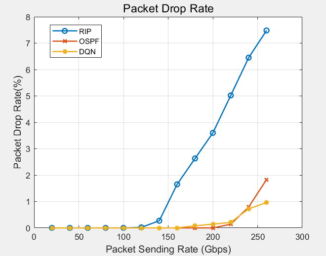
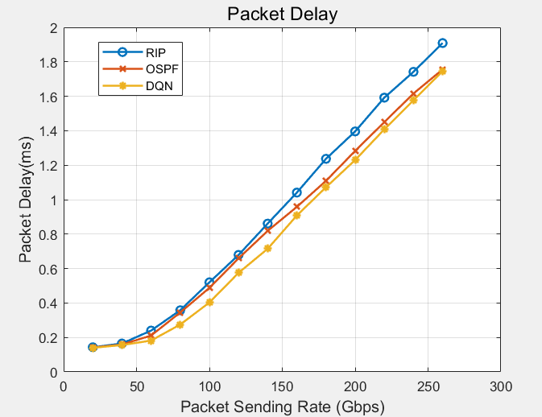
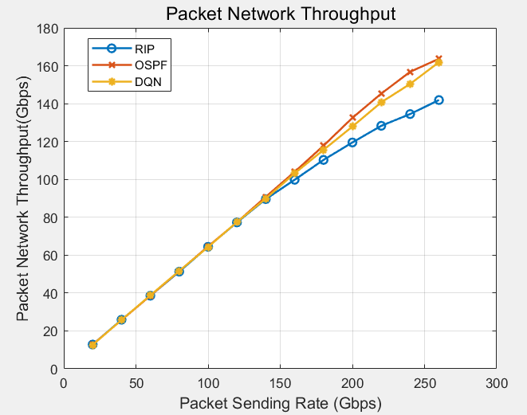

# 利用DQN算法对网络中的数据包进行动态路由，从而获得最佳的服务质量（仿真实验）

## 摘要

在一码通缓存系统中，我们通过DQN算法，从k-最短路径算法中选出的k条相对最优路径中，根据路由器的缓存内容和数量，找到一条最优的缓存内容转移路径，从而使过载服务器的压力减小，降低系统崩溃的可能性。我们基于DQN根据路由器与网络状态之间交互的奖励值大小进行了选路过程的模拟。在DQN模型训练后，得到了我们的算法在QoS上相比于传统算法（OSPF、RIP）的性能对比，说明我们的算法相比于传统算法具有明显的优势。

## 性能分析图

### 丢包率

### 时延

### 吞吐量

